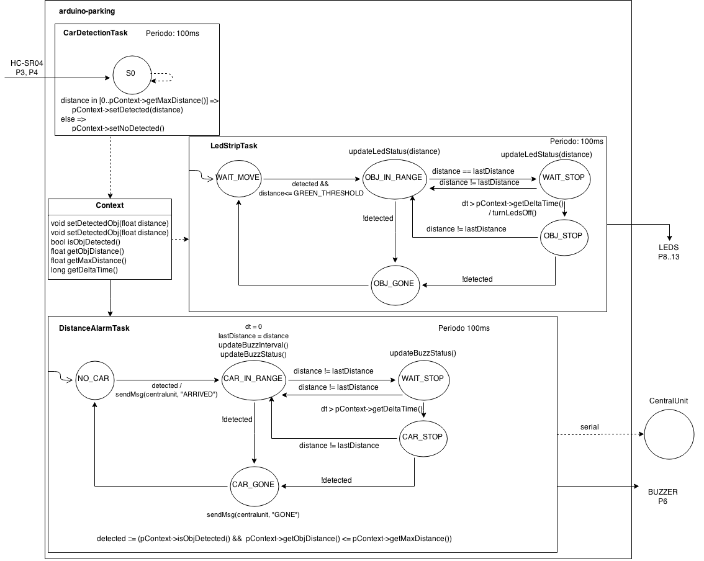
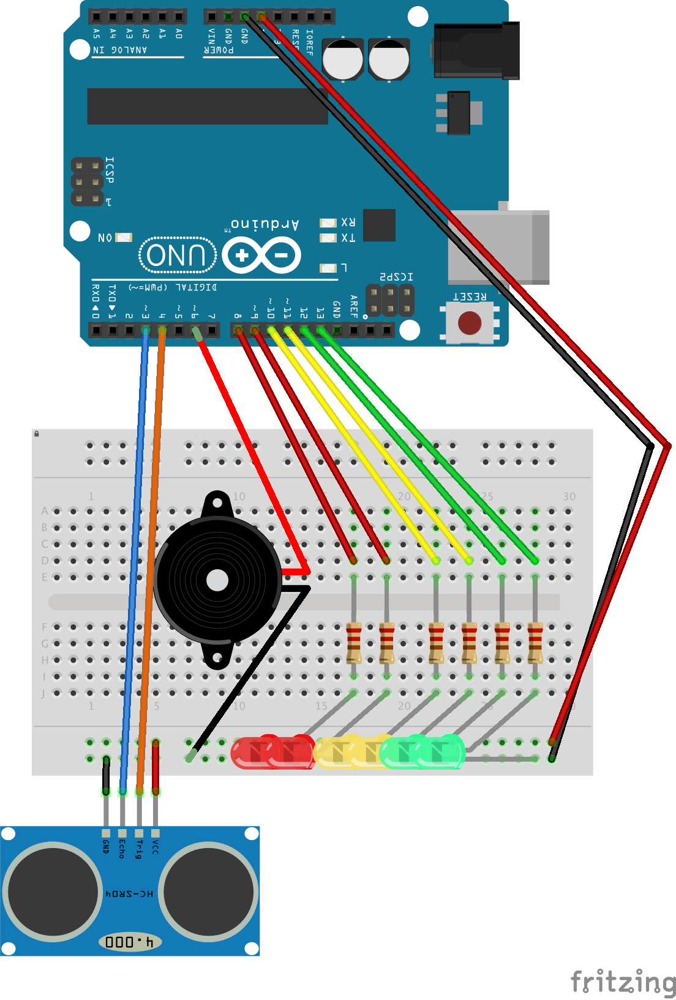

# arduino-parking
A parking lot management system, implemented with Arduino and Raspberry pi.

This project is an attempt to focus on a paradigmatic and engineering point of view in developping embedded systems.

*NB: This repo contains only the arduino skecth. For a complete running example, see instructions [here](https://github.com/AL333Z/play-parking-pi).*

#Structure

The system has 3 main tasks, modelled as *syncronous finite state machine*.

The interaction between each task is mediated by a shared singleton instance of the class `Context`, that contains informations about the current system status.
Since we can consider state transition for each FSM (task) occurring atomically, in accessing `Context` there aren't race conditions at all.
```c++
  // distance to consider a car arrived: 4m
  // delta to consider a car stopped: 3s
  Context* pContext = new Context(4, 3000); 
```

##Tasks

- **CarDetectionTask**, detecting the presence of a car nearby the distance sensor and comunicating that distance to the system.
```c++
  Task* t0 = new CarDetectionTask(3, 4, pContext); // trig at pin 3, echo at pin 4
  t0->init(100);                                   // 100ms perdiod
```

- **LedStripTask**, that reacts to the presence of a car nearby the sensor turning on and off a led strip (the number of leds turned on is inversely proportional to the distance of the car from the sensor)
```c++
  int leds[] = {13, 12, 11, 10, 9 , 8};             // array of pins for led strip
  Task* t1 = new LedStripTask(leds, 6, pContext);   
  t1->init(100);                                    // 100ms period
```

- **DistanceAlarmTask**, that reacts to the presence of a car nearby emitting a sound (with a buzzer) that is related to the distance of the car and sending a message to the serial port when:
  - a car did arrived
  - a car did gone
```c++
  Task* t2 = new DistanceAlarmTask(6, pContext);  // buzzer at pin 6
  t2->init(100);                                  // 100ms period
``` 

The priority of each task is implicitly determined by the order in which they are added to the scheduler, in the `setup` method.

#Tasks diagram



#Hardware


#Credits

The original idea has been taken from [here](https://sarpur.wordpress.com/2012/08/18/arduino-uno-parking-sensor/).

The foundation of this project has been taken from the course `Embedded Systems Programming`, `Unibo 2014/2015`.
